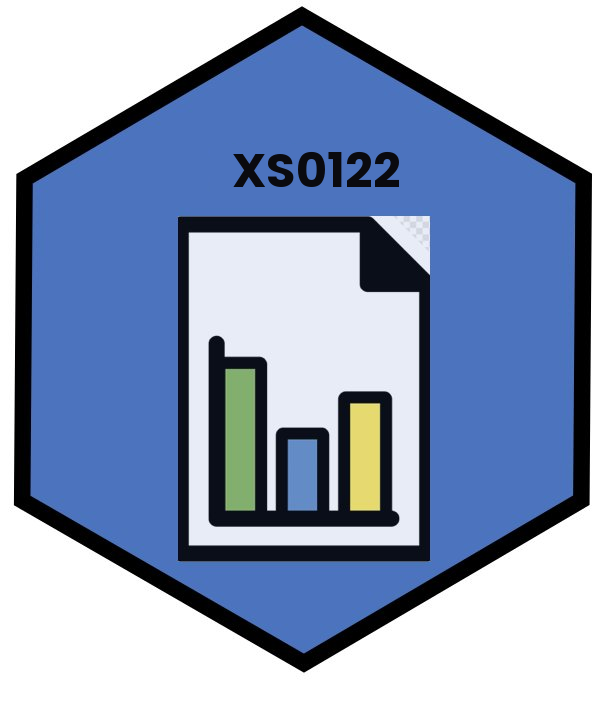

<H1 align="center"> 
<figure></figure>
</H1>

**Curso:** Modelos Probabilísticos I

**Código:** XS-0122

**Material del curso:** [https://alesalasv.github.io/XS0122/](https://alesalasv.github.io/XS0122/)

**Aula virtual:** [https://mv.mediacionvirtual.ucr.ac.cr/login/index.php](https://mv.mediacionvirtual.ucr.ac.cr/login/index.php){:target="_blank"}

**Profesores:** M.Sc. Alejandro Salas Vargas.

**Descripción del curso:**
La teoría de probabilidad es requisito fundamental para introducir al estudiantado a la inferencia estadística. Este curso es teórico-práctico y se enfoca principalmente en proporcionar los fundamentos de la teoría de la probabilidad en espacios discretos y continuos con aplicaciones a fenómenos aleatorios como los juegos de azar, muestreo, salud, demografía y finanzas, entre otras disciplinas.

[Programa del curso](Programa_XS0122_Modelos_Proba_Isemestre_2026.pdf){:target="_blank"}

<!--   -->

## Presentaciones

| Tema                                                                                  | Clase    |
|---------------------------------------------------------------------------------------|----------|
| Introducción                                                                          | <a href="Clase1.html" target="_blank">Clase 1</a>|
| Métodos de Conteo                                                                     | <a href="Clase2.html" target="_blank">Clase 2</a>  |

