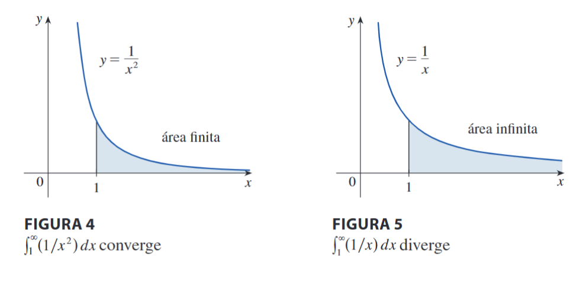
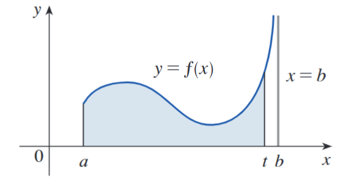
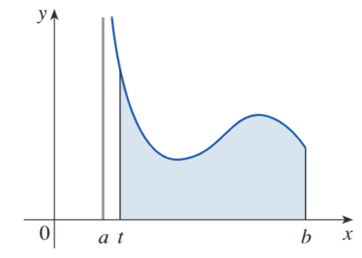

## Integrales de primera especie

**Definición de una integral impropia de tipo 1**

(a) Si $\displaystyle\int_a^t f(x)\,dx$ existe para todo número $t \geq a$, entonces
$$\int_a^{+\infty} f(x)\,dx = \lim_{t\to +\infty}\int_a^t f(x)\,dx$$
siempre y cuando este límite exista (como un número finito).

(b) Si $\displaystyle\int_t^b f(x)\,dx$ existe para todo número $t \leq b$, entonces
$$\int_{-\infty}^b f(x)\,dx = \lim_{t\to -\infty}\int_t^b f(x)\,dx$$
siempre y cuando este límite exista (como un número finito).

---

Las integrales impropias $\displaystyle \int_a^{+\infty} f(x)\,dx$ y $\displaystyle\int_{-\infty}^b f(x)\,dx$ se denominan **convergentes** si
existe el límite correspondiente y **divergentes** si el límite no existe.

(c) Si tanto $\displaystyle\int_a^{+\infty} f(x)\,dx$ como $\displaystyle\int_{-\infty}^a f(x)\,dx$ son convergentes, entonces se define
$$\int_{-\infty}^{+\infty} f(x)\,dx = \int_{-\infty}^a f(x)\,dx + \int_a^{+\infty} f(x)\,dx$$

En el inciso (c) se puede usar cualquier número real $a$.

## Integrales de primera especie

$$\int_1^{+\infty} \frac{1}{x^2}\,dx \text{ converge} \qquad\qquad \int_1^{+\infty} \frac{1}{x}\,dx \text{ diverge}$$

{fig-align="center"}

Geométricamente, aunque las curvas $y = 1/x^2$ y $y = 1/x$ se ven muy similares para $x > 0$, la región debajo de $y = 1/x^2$ a la derecha de $x = 1$ tiene un área finita, mientras que la región correspondiente debajo de $y = 1/x$ tiene un área infinita. Observe que $1/x^2$ se aproxima a $0$ más rápido que $1/x$ cuando $x\to+\infty$; los valores de $1/x$ no disminuyen lo suficientemente rápido para que su integral tenga un valor finito.

## Integrales de primera especie — Ejercicios

Resolver las siguientes integrales:

1. $\displaystyle\int_3^{+\infty} \frac{1}{x\ln^2 x}\,dx$

2. $\displaystyle\int_{-\infty}^{0} x e^{x}\,dx$

3. $\displaystyle\int_0^{+\infty} x e^{-x}\,dx$

4. $\displaystyle\int_{-\infty}^{+\infty} \frac{1}{1+x^2}\,dx$

## Integrales de segunda especie

**Definición de una integral impropia de tipo 2**

(a) Si $f$ es continua en $[a, b[$ y discontinua en $b$, entonces
$$\int_a^b f(x)\,dx = \lim_{t\to b^-}\int_a^t f(x)\,dx$$
si este límite existe (como un número finito).

{fig-align="center"}

## Integrales de segunda especie

(b) Si $f$ es continua en $]a, b]$ y discontinua en $a$, entonces
$$\int_a^b f(x)\,dx = \lim_{t\to a^+}\int_t^b f(x)\,dx$$
si este límite existe (como un número finito).

{fig-align="center"}

La integral impropia $\displaystyle \int_a^b f(x)\,dx$ se denomina **convergente** si existe el límite correspondiente y **divergente** si el límite no existe.

## Integrales de segunda especie

(c) Si $f$ tiene una discontinuidad en $c$, donde $a < c < b$, y tanto $\displaystyle \int_a^c f(x)\,dx$ como $\displaystyle\int_c^b f(x)\,dx$ son convergentes, entonces se define
$$\int_a^b f(x)\,dx = \int_a^c f(x)\,dx + \int_c^b f(x)\,dx$$

## Integrales de segunda especie — Ejercicios

Resolver las siguientes integrales:

1. $\displaystyle\int_2^5 \frac{1}{\sqrt{x-2}}\,dx$

2. $\displaystyle\int_0^1 \frac{e^{1/x}}{x^3}\,dx$
