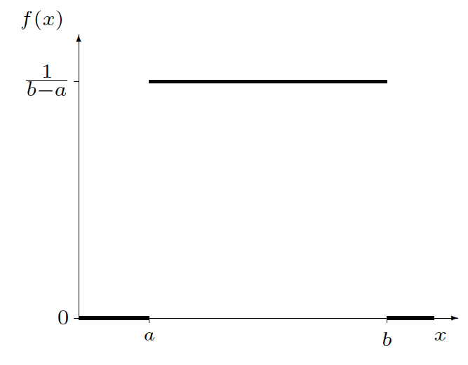

## Distribución Uniforme

Supongamos que una variable puede tomar valores al azar en un rango y que la probabilidad de que tome valores en cualquier intervalo de longitud fija sea la misma.

**Definición.** Si $\theta_1 < \theta_2$, se dice que una variable aleatoria $X$ tiene distribución
de probabilidad **uniforme** en el intervalo $(\theta_1, \theta_2)$ si y solo si la función de densidad
y distribución de $X$ son

$$f_X(x) = \begin{cases} \dfrac{1}{\theta_2-\theta_1} & \text{si } \theta_1 \leq x \leq \theta_2 \\ 0 & \text{en cualquier otro punto} \end{cases}$$

$$F_X(x) = \begin{cases} 0 & \text{si } x < \theta_1 \\ \dfrac{x-\theta_1}{\theta_2-\theta_1} & \text{si } \theta_1 \leq x \leq \theta_2 \\ 1 & \text{si } x > \theta_2 \end{cases}$$

Se escribe: $X \sim U(\theta_1,\theta_2)$.

## Distribución Uniforme

{fig-align="center"}

## Distribución Uniforme

**Definición.** Las constantes que determinan la forma específica de una función de densidad se denominan **parámetros** de la función de densidad.

**Ejemplo.** La llegada de clientes a una caja en un establecimiento sigue una distribución de
Poisson. Se sabe que durante un periodo determinado de 30 minutos, un cliente llega a la caja.
Encuentre la probabilidad de que el cliente llegue durante los últimos 5 minutos del periodo de
30 minutos.

**Solución.** Si se sabe que exactamente uno de estos eventos ha ocurrido en el intervalo $(0, 30)$,
entonces el tiempo real del suceso está distribuido de manera uniforme en este intervalo. Si $X$
denota el tiempo de llegada, entonces:

$$P(25 \leq X \leq 30) = \int_{25}^{30} \frac{1}{30}\,dy = \frac{30-25}{30} = \frac{5}{30} = \frac{1}{6}$$

La probabilidad de que la llegada ocurra en cualquier otro intervalo de 5 minutos también es $\dfrac{1}{6}$.


## Distribución Uniforme

La distribución uniforme es muy importante por razones teóricas. Los estudios de simulación son técnicas valiosas para validar modelos en estadística. Si deseamos un conjunto de observaciones de una variable aleatoria con función de distribución $F(x)$, a menudo podemos obtener los resultados deseados si transformamos un conjunto de observaciones en una variable aleatoria uniforme.

Por esta razón, casi todos los sistemas de cómputo contienen un generador de números aleatorios que produce valores observados para una variable aleatoria que tiene una distribución uniforme continua.

**Generador de números aleatorios:** generación de una variable aleatoria que tiene una distribución uniforme continua. **Universalidad de la Uniforme.** Ver:

<https://www.youtube.com/watch?v=TzKANDzAXnQ>

## Distribución Uniforme

**Teorema.** Si $\theta_1 < \theta_2$ y $X$ es una variable aleatoria uniformemente distribuida
en el intervalo $(\theta_1, \theta_2)$, entonces:

$$\mu = E(X) = \frac{\theta_1+\theta_2}{2}, \qquad Var(X) = \frac{(\theta_2-\theta_1)^2}{12}$$

**Prueba:**

$$E(X) = \int_{-\infty}^{\infty} x f(x)\,dx = \int_{\theta_1}^{\theta_2} \frac{x}{\theta_2-\theta_1}\,dx = \frac{1}{\theta_2-\theta_1}\cdot\frac{x^2}{2}\Bigg|_{\theta_1}^{\theta_2} = \frac{\theta_2^2-\theta_1^2}{2(\theta_2-\theta_1)} = \frac{\theta_1+\theta_2}{2}$$

$$E(X^2) = \int_{-\infty}^{\infty} x^2 f(x)\,dx = \int_{\theta_1}^{\theta_2} \frac{x^2}{\theta_2-\theta_1}\,dx = \frac{1}{\theta_2-\theta_1}\cdot\frac{x^3}{3}\Bigg|_{\theta_1}^{\theta_2} = \frac{\theta_2^3-\theta_1^3}{3(\theta_2-\theta_1)}$$

$Var(X) = E(X^2) - [E(X)]^2 = \frac{\theta_2^3-\theta_1^3}{3(\theta_2-\theta_1)} - \left(\frac{\theta_1+\theta_2}{2}\right)^2 = \frac{4(\theta_2^3-\theta_1^3)-3(\theta_1+\theta_2)^2(\theta_2-\theta_1)}{12(\theta_2-\theta_1)} = \frac{(\theta_2-\theta_1)^2}{12}$

## Distribución Uniforme

**Ejemplo.** Suponga que $Y$ tiene una distribución uniforme en el intervalo $(0, 1)$.

a. Encuentre $F(y)$.

$$F_Y(y) = \begin{cases} 0 & \text{si } y < 0 \\ \displaystyle\int_0^y 1\,dt = y & \text{si } 0 \leq y \leq 1 \\ 1 & \text{si } y > 1 \end{cases}$$

b. Demuestre que $P(a \leq Y \leq a+b) = b$, para $a \geq 0$, $b \geq 0$ y $a+b \leq 1$, y que esta probabilidad depende solo del valor de $b$.

$$P(a \leq Y \leq a+b) = F(a+b) - F(a) = (a+b) - a = b$$

R/ La probabilidad depende únicamente de la longitud $b$ del intervalo, independientemente de su ubicación $a$.

## Distribución Uniforme

**Ejemplo.** Al usar el método de triangulación para determinar el alcance de una sonda acústica, el equipo de prueba debe medir con precisión el tiempo que tarda en llegar el frente de onda esférica a un sensor de recepción. De acuerdo con Perruzzi y Hilliard (1984), los errores de medición se pueden modelar como si tuvieran una distribución uniforme de $-0.05$ a $+0.05\,\mu$s (microsegundos).

a. ¿Cuál es la probabilidad de que una medición de tiempo de llegada sea precisa con tolerancia de $0.01\,\mu$s?

Sea $X$ la cantidad del error de medición, es decir, $X \sim U(-0.05, 0.05)$.
La función de distribución es $F_X(x) = \dfrac{x+0.05}{0.1}$ para $-0.05 \leq x \leq 0.05$.

$P(-0.01 \leq X \leq 0.01) = F(0.01) - F(-0.01) = \frac{0.01+0.05}{0.1} - \frac{-0.01+0.05}{0.1} = \frac{0.06-0.04}{0.1} = \frac{0.02}{0.1} = 0.2$

```{r}
#| echo: true
punif(0.01, -0.05, 0.05) - punif(-0.01, -0.05, 0.05)
```


R/ $P(-0.01 \leq X \leq 0.01) = 0.2$

## Distribución Uniforme

b. Encuentre la media y la varianza de los errores de medición.

$$E(X) = \frac{\theta_1+\theta_2}{2} = \frac{-0.05+0.05}{2} = 0$$

$$Var(X) = \frac{(\theta_2-\theta_1)^2}{12} = \frac{(0.05+0.05)^2}{12} = \frac{(0.1)^2}{12} = \frac{0.01}{12} = \frac{1}{1200}$$

```{r}
#| echo: true
x <- runif(100000000, -0.05, 0.05)
round(mean(x), 5)

round(var(x), 5)

```

R/ $E(X) = 0$, $Var(X) = \dfrac{1}{1200} \approx 0.000\overline{8}$

## Distribución Uniforme

```{r}
#| echo: true
varunif <- runif(10000000, -0.05, 0.05)
hist(varunif, freq = FALSE,
     main = "Histograma de una variable aleatoria uniforme")
lines(seq(-0.05, 0.05, 0.001),
      dunif(seq(-0.05, 0.05, 0.001), -0.05, 0.05), col = 3)
```


## Distribución Normal (y Estándar)

La distribución normal o gaussiana es, probablemente, la distribución continua más conocida y
utilizada.

**Definición.** Se dice que una variable aleatoria $X$ tiene distribución de
probabilidad **normal** si y solo si para $\sigma > 0$ y $-\infty < \mu < \infty$, la función de
densidad de $X$ es

$$f_X(x) = \frac{1}{\sigma\sqrt{2\pi}}\,e^{-\dfrac{(x-\mu)^2}{2\sigma^2}}, \qquad -\infty < x < \infty$$

La distribución tiene dos parámetros: $\mu$ y $\sigma$.

Véase una visualización interactiva en: <https://seeing-theory.brown.edu/probability-distributions/es.html>

**Teorema.** Si $X$ es una variable aleatoria normalmente distribuida con parámetros $\mu$ y $\sigma$, entonces $E(X) = \mu$ y $Var(X) = \sigma^2$.

La prueba se realizará al cubrir la función generadora de momentos para el caso continuo.

## Distribución Normal (y Estándar)

```{r}
#| echo: true
varnorm <- rnorm(10000000, 0, 10)
hist(varnorm, freq = FALSE,
     main = "Histograma de una variable aleatoria normal")
lines(seq(-40, 40, 0.01), dnorm(seq(-40, 40, 0.01), 0, 10), col = 3)
```


## Distribución Normal (y Estándar)

```{r}
#| echo: true
varnorm <- rnorm(10000000, 0, 10)
round(mean(varnorm), 3)

round(var(varnorm), 3)

```

Las áreas bajo la función de densidad normal correspondientes a $P(a \leq X \leq b)$ requieren la
evaluación de la integral:

$$F_X(x) = \int_a^b \frac{1}{\sigma\sqrt{2\pi}}\,e^{-\dfrac{(x-\mu)^2}{2\sigma^2}}\,dx, \qquad -\infty < x < \infty$$

No existe una expresión de forma cerrada para esta integral, por lo que se debe
recurrir a métodos de integración numérica.

## Distribución Normal (y Estándar)

**Ejemplo.**

a. $P(2 \leq Y \leq 4)$ para $Y \sim N(0, 3)$

```{r}
#| echo: true
pnorm(4, 0, sqrt(3)) - pnorm(2, 0, sqrt(3))
```

R/ $P(2 \leq Y \leq 4) \approx 0.1136$

b. $P(Y \leq b) = 0.05$ para $Y \sim N(0, 3)$

```{r}
#| echo: true
qnorm(0.05, 0, sqrt(3))
```

R/ $b \approx -2.849$

La función de densidad normal es simétrica alrededor del valor $\mu$, de modo que las áreas
pueden describirse en un solo lado de la media (como en las tablas estadísticas).

## Distribución Normal (y Estándar)

**Ejemplo.** Denote con $Z$ una variable aleatoria normal estándar con media $0$ y $\sigma = 1$.

a. Encuentre $P(Z > 2)$.

```{r}
#| echo: true
1 - pnorm(2, 0, 1)

pnorm(2, 0, 1, lower.tail = FALSE)

```

R/ $P(Z > 2) \approx 0.0228$

## Distribución Normal (y Estándar)

b. Encuentre $P(-2 \leq Z \leq 2)$.

```{r}
#| echo: true
pnorm(2, 0, 1) - pnorm(-2, 0, 1)

1 - 2 * pnorm(2, 0, 1, lower.tail = FALSE)

```

R/ $P(-2 \leq Z \leq 2) \approx 0.9545$

c. Encuentre $P(0 \leq Z \leq 1.73)$.

```{r}
#| echo: true
pnorm(1.73, 0, 1) - pnorm(0, 0, 1)

```

R/ $P(0 \leq Z \leq 1.73) \approx 0.4582$

Siempre podemos transformar una variable aleatoria normal $X$ en una variable aleatoria
normal estándar $Z$ usando la relación:

$$Z = \frac{X - \mu}{\sigma}$$

## Distribución Normal (y Estándar)

{fig-align="center" width="78%"}

¿Tienen sus calculadoras un modo estadístico? De ser así, entonces pueden calcular estos
valores usando la calculadora.

## Distribución Normal (y Estándar)

**Ejemplo.** Si $Z$ es una variable aleatoria normal estándar, encuentre el valor $z_0$ tal que:

a. $P(Z > z_0) = 0.5$

```{r}
#| echo: true
qnorm(0.5, 0, 1)

```

R/ $z_0 = 0$

b. $P(Z < z_0) = 0.8643$

```{r}
#| echo: true
qnorm(0.8643, 0, 1)

```

R/ $z_0 \approx 1.10$

c. $P(-z_0 < Z < z_0) = 0.90$

$P(-z_0 < Z < z_0) = F(z_0) - F(-z_0) = F(z_0) - [1-F(z_0)] = 2F(z_0) - 1 = 0.90$

```{r}
#| echo: true
qnorm(1.90 / 2, 0, 1)

```

R/ $z_0 \approx 1.645$

## Distribución Normal (y Estándar)

d. $P(-z_0 < Z < z_0) = 0.99$

$$P(-z_0 < Z < z_0) = 2F(z_0) - 1 = 0.99 \implies F(z_0) = 0.995$$

```{r}
#| echo: true
qnorm(1.99 / 2, 0, 1)

```

R/ $z_0 \approx 2.576$

## Ejercicios

Resuelva los siguientes ejercicios del libro de texto:

1. **Distribución Uniforme:** ejercicios 4.39 – 4.57
2. **Distribución Normal:** ejercicios 4.58 – 4.80
